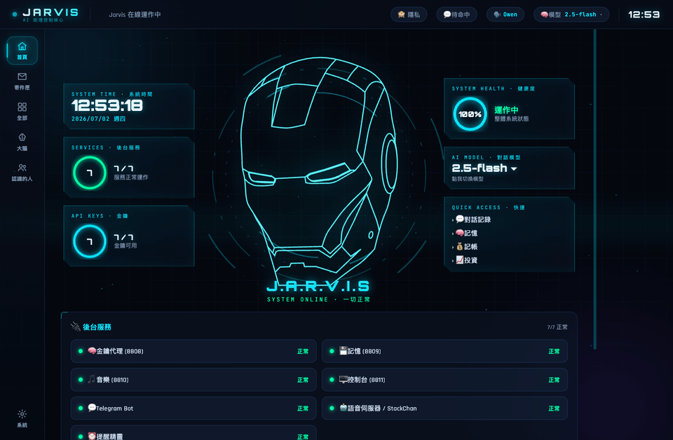
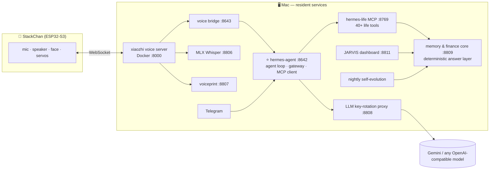
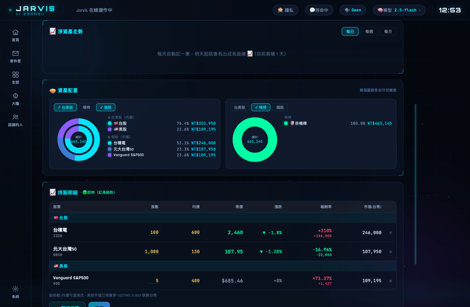
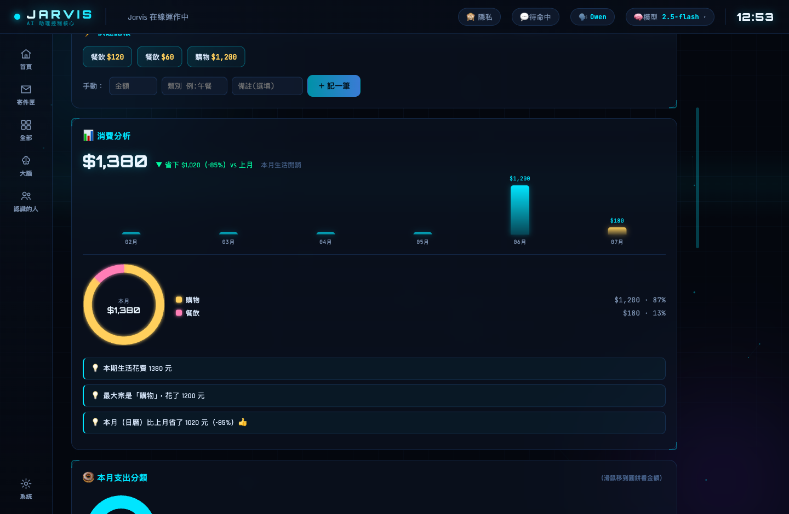

<div align="center">

# 🤖 J.A.R.V.I.S

### Your one-of-a-kind personal AI super-assistant — embodied, ever-present, self-evolving.

**One brain, three bodies:** a desktop robot (voice) × Telegram × an Iron-Man-style command center — sharing a single memory, a single personality, and a single set of tools.



[繁體中文](README.zh-TW.md) · [Deploy](docs/DEPLOY.md) · [Extend](docs/EXTENDING.md)

*(All screenshots use demo data)*

</div>

---

## Why build this

Off-the-shelf assistants are built for everyone — which means they belong to no one. Jarvis is the opposite: **a super-assistant engineered around exactly one person.** It knows your finances to the dollar, your habits, your goals, and how you like to be spoken to — and it gets measurably better at all of it every single night, on its own.

Three engineering principles make that possible:

1. **Numbers are computed, never generated.** Every financial answer comes from a deterministic calculation layer — the LLM only reads results aloud.
2. **One brain everywhere.** Voice, Telegram and the dashboard hit the same agent runtime, the same tools, the same memory. Tell it something once, it knows it everywhere, instantly.
3. **It evolves without being watched.** Nightly jobs review the day's conversations to refine its personality and to build the capabilities it discovered it was missing.

## A day with Jarvis

- **07:30** — Morning briefing on your Telegram: weather, agenda, overnight US-market results for *your* holdings
- **All day** — You talk to the robot on your desk: log expenses, query any slice of your finances, set reminders, manage todos, draft emails (sent only after your confirmation), ask it to research anything, or tell it to *build itself a new feature*
- **Market hours** — It watches your portfolio and speaks up on significant moves; after each close (TW & US) it pushes a full P&L report
- **Anytime, anywhere** — Same brain on Telegram when you're out; the JARVIS command center visualizes everything at home
- **03:00** — It reads the whole day's conversations, distills new rules about how to serve you better, writes them into its own personality, then audits its capability gaps and builds the most valuable missing feature — with automatic backup, smoke-testing and rollback
- **07:30 next day** — A slightly better Jarvis wakes up with you

## Capabilities

| Domain | What it does |
|---|---|
| 💰 **Personal finance** | Full income/expense/budget tracking · real-time TW & US portfolio (returns, daily P&L, per-holding) · net-worth trend (daily/weekly/monthly) · goal-gap and compound-interest projections · per-category analytics · voice bookkeeping with a deterministic capture net |
| 🗣️ **Voice companion** | Wake-word ("Jarvis"), continuous conversation, interruption · local Whisper ASR on Apple Metal (~1s, Traditional Chinese) · voiceprint owner recognition · facial expressions & head motion synced to emotion |
| 🧠 **Memory** | Hybrid vector + keyword retrieval · deterministic fact extraction from every conversation · profile always injected into context · dashboard editing with instant sync |
| 📬 **Communications** | Telegram two-way chat · email drafting with contact lookup and human-confirmed sending · proactive notifications (payday, budget pace, market moves) |
| 🛠️ **Self-extension** | One sentence → full-stack feature (backend API + voice tool + dashboard panel), auto-deployed behind safety gates · nightly capability proposals |
| 🖥️ **Command center** | Iron-Man HUD · finance & portfolio visualizations (multi-ring allocation charts, interactive trends) · memory/chat/evolution/mail consoles · service health & model switching |
| 🔒 **Privacy** | Voiceprint-gated identity · automatic financial masking for guests · everything runs on your own machine |

## Architecture



### ⭐ The brain: hermes-agent

The heart of the system is **hermes-agent** — a self-hosted agent runtime that acts as the *single* brain for every channel:

- **Multi-platform gateway**: one process serves Telegram, the voice bridge and an OpenAI-compatible API — so every channel is literally the same agent, not a synced copy
- **Server-side agent loop**: multi-step reasoning with parallel tool execution and iteration budgeting
- **MCP-native tooling**: capabilities are registered once as MCP tools (hermes-life for life/finance, stackchan for the robot body) and every channel gains them simultaneously
- **Live context injection**: personal facts, self-learned interaction rules (SOUL) and real-time state are injected fresh on every turn
- **Skills & self-awareness**: an extensible skill hub plus a generated-per-turn self-state so the agent always knows what it can currently do

### 🤖 The body: StackChan integration

The physical presence is a [StackChan](https://github.com/meganetaaan/stack-chan) robot on M5Stack CoreS3 (ESP32-S3), integrated end-to-end:

- **On-device wake word** ("Jarvis") with instant head-raise acknowledgment
- **WebSocket audio streaming** to the xiaozhi voice server (Opus, 16 kHz), with automatic audio-desync self-healing on reconnect
- **Continuous conversation**: after each reply it keeps listening — no re-wake needed; you can interrupt mid-sentence
- **Voiceprint identity** at the ASR layer: the robot knows *who* is speaking; guests are automatically privacy-masked
- **Embodied emotion**: the LLM picks an emotion each turn; face and head motion follow
- **Proactive voice**: reminders and alerts make the robot speak up on its own via a server-side voice queue

## The command center

Interactive portfolio analytics — net-worth trend with selectable granularity and goal progress, multi-select nested allocation rings (market / leverage / per-holding), hover details on every slice:



| Home HUD | Bookkeeping |
|---|---|
|  |  |

## Correctness engineering

- **Deterministic answer layer** — high-frequency money questions are answered by Python computation that produces the *complete sentence*; the model recites it verbatim
- **Semantic normalization** — when a phrasing doesn't match, a lightweight LLM pass rewrites it into canonical form (preserving entities, converting Chinese numerals) before hitting the deterministic layer — so *any* way of asking lands on the computed answer
- **Deterministic capture nets** — bookkeeping and memory extraction run as independent watchers over the conversation log, so nothing depends on the model remembering to call a tool
- **Safety-gated self-modification** — every autonomous code change is preceded by backups and followed by smoke tests (AST / YAML / HTML integrity) with automatic rollback and a self-repair loop

## Quick start

```bash
git clone https://github.com/owen4sure/jarvis && cd jarvis
python3 -m venv .venv && .venv/bin/pip install -r brain/requirements-embodied.txt
cp .env.example .env                                              # your LLM keys
cp brain/config/finance.example.json brain/config/finance.json    # your numbers
cp brain/config/telegram.example.json brain/config/telegram.json
cp brain/launchd/*.plist ~/Library/LaunchAgents/ && launchctl load ~/Library/LaunchAgents/com.hermes.*.plist
open http://localhost:8811
```

Full guide (all 9 services, the robot, the brain): **[docs/DEPLOY.md](docs/DEPLOY.md)**

## Extending Jarvis

Three ways, from zero-code to full control — including simply *telling Jarvis to build it*:
**[docs/EXTENDING.md](docs/EXTENDING.md)**

## License

MIT — build your own Jarvis.
