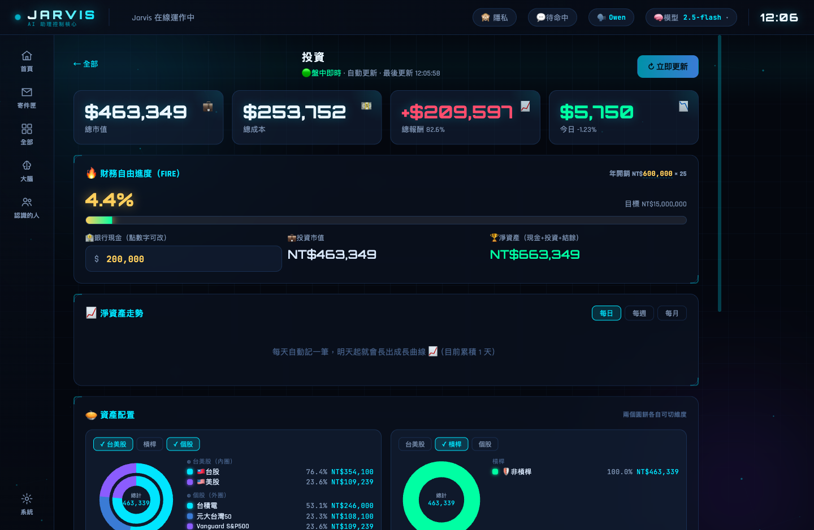
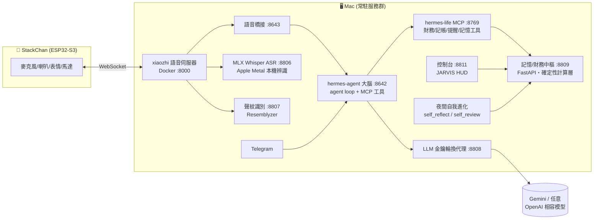

<div align="center">

# 🤖 Jarvis — 桌上實體 AI 生活助理

**一顆大腦・三個分身:桌上機器人(語音)× Telegram × 鋼鐵人風格控制台,共用同一份記憶與人格,還會在你睡覺時自我進化。**


*(畫面為示範資料)*

</div>

> **EN TL;DR** — Jarvis is a personal AI companion living in a StackChan (ESP32-S3) desktop robot, reachable via voice, Telegram, and a JARVIS-style web dashboard — all sharing **one brain, one memory, one personality**. It manages real personal finance with a **deterministic answer layer** (the LLM never does arithmetic), understands paraphrased intents via **semantic normalization**, runs **nightly self-evolution** (learns how to treat you + proposes/builds new capabilities via Claude Code with backup/smoke-test/rollback gates), and can **extend itself full-stack** from a single voice command. Built solo, in production daily on a Mac mini + ESP32.

---

## 為什麼做這個

市面上的語音助理有三個通病:**答錯數字**(LLM 心算)、**跨裝置人格分裂**(手機問過的事音箱不知道)、**功能永遠固定**(缺什麼只能等原廠)。

Jarvis 的三個對應答案:

1. **錢的數字 100% 程式算**——LLM 只負責「照唸」,不負責計算
2. **單一大腦架構**——語音、Telegram、控制台打同一個 agent、讀寫同一份記憶
3. **會自我進化**——每晚回顧當天對話,學「怎麼相處」也提案「該長什麼新能力」,經安全閘後自己把功能寫出來上線

## 它每天在做什麼(真實使用場景)

- 🗣️ 「Jarvis,我今天花多少?」→ 逐筆列出、含分類,數字保證正確
- 📈 「我最賺的股票是哪支?」→ 台股/美股即時報價、報酬率、離資產目標多遠
- 💰 「如果年化 15%,我每月要存多少才能 40 歲存到一千萬?」→ 複利反解,秒答
- 🧾 「拿鐵 85」→ 記帳(就算模型忘了呼叫工具,確定性攔截器也會補記)
- 📬 「幫我擬信給 Sandy 說會議改期」→ 找到聯絡人、擬稿、**你確認才寄**
- 🌙 每晚 03:00 自我反省:「Owen 討厭囉嗦,回答要直接給結論」→ 寫進人格,隔天生效
- 🛠️ 「幫我做一個記錄喝水的功能」→ 自己寫後端+語音工具+控制台面板,自動上線

## 展示

| 首頁(系統 HUD) | 記帳 | 投資 |
|---|---|---|
|  |  |  |

## 系統架構



**關鍵設計:工具在伺服器端統一註冊。** 語音和 Telegram 都指向同一個 hermes-agent,工具掛在 hermes-life MCP——**加一次工具,所有管道同時獲得**,記憶與人格天然同步。

## 工程亮點(給想深入的人)

### 1. 錢的數字不讓 LLM 碰 — 確定性答案層
高頻財務問題(今天花多少/離目標多遠/每月要存多少)由 **程式直接計算出完整句子**,模型只照唸。複利反解、缺口計算、預算分攤全是 Python,不是 token 機率。**LLM 答錯錢 = 信任歸零**,所以這層是整個系統的地基。

### 2. 語意正規化 — 不靠關鍵字
「我美金部位如何」「哪支最威」「八百萬每月要存多少」——關鍵字匹配必漏。做法:關鍵字沒命中時,用一次輕量 LLM 呼叫把任意講法**改寫成標準問法**(保留實體、中文數字轉阿拉伯),再進確定性層。實測 14 種非標準講法 14 中。

### 3. 夜間自我進化(雙系統+三道安全閘)
- **人格進化** `self_reflect`:每晚讀當天全部對話,萃取「≤30字的相處守則」寫進 SOUL.md,隔天每輪注入
- **能力進化** `self_review`:找出「答不出/做不到」的缺口 → 自主建置最有價值的一個,其餘提案到 Telegram
- **安全閘**:auto-build 前備份 5 個關鍵檔 → 建完冒煙測試(Python AST + YAML + HTML 完整性)→ 失敗自動還原。前身 evolution_engine 是「只會標記完成的假進化」,這套是它的反省之作。

### 4. 一句話長出全棧功能
`build_feature` 把需求丟給 Claude Code CLI:後端 API + 語音工具 + 控制台面板 + API 串接一次寫完,冒煙測試通過後**自動重啟上線**;失敗會把錯誤餵回去自我修正(最多 3 輪 loop)。

### 5. 延遲工程
從「講完話」到「開始回答」的關鍵路徑逐步掐錶:把回應沒人讀的呼叫移到背景執行緒、self_state 與記憶檢索並行化、確定性記帳攔截 fire-and-forget——最壞情況阻塞預算 **17s → 8s**。ASR 用 Apple Metal 跑 Whisper large-v3-turbo(~1s),並動態把**使用者的真實持股名**餵進辨識提示,從源頭減少專有名詞錯字。

### 6. 隱私分層
聲紋認主人 → 訪客講話自動觸發**財務遮罩**(只給 %、不給金額);身份檔帶 120 秒時效自癒,解決「訪客講完話、主人自己的 Telegram 被誤鎖」的跨管道 race。設計底線:**寧可不鎖,絕不誤鎖主人**。

### 7. 記憶架構
`facts.jsonl`(單一真相)+ 本機 nomic 向量 + 關鍵字混合檢索;`memory_scribe` 每 5 分鐘從對話確定性抽事實(不靠模型記得呼叫工具);與 agent 的 USER.md 雙向同步、快照防「刪掉的記憶復活」、語意相似閘防「改寫版重複」。

## 誠實的取捨(這些是故意的)

| 取捨 | 為什麼 |
|---|---|
| VAD 靜音判定 1.5s(回答慢~1秒) | 使用者明確要「話沒講完絕不切斷」優先 |
| 語音每輪全新 session | 避免舊話題/舊時間殘留污染,以每輪重建 prompt 為代價 |
| 訪客遮罩 fail-open | 聲紋不夠穩前,誤鎖主人比洩漏給訪客更不可接受 |
| 能力自我進化一晚限 1 個 | 控制無人監督改碼的爆炸半徑 |

## 部署

**硬體**:Apple Silicon Mac(常駐)+ M5Stack CoreS3(StackChan,選配——沒有機器人也能用 Telegram+控制台)

```bash
# 1. 大腦與服務
git clone https://github.com/YOUR_NAME/jarvis && cd jarvis
python3 -m venv .venv && .venv/bin/pip install -r brain/requirements-embodied.txt
cp .env.example .env                                # 填 GEMINI_API_KEY 等
cp brain/config/finance.example.json brain/config/finance.json   # 改成你的財務
cp brain/config/telegram.example.json brain/config/telegram.json

# 2. 常駐服務(launchd 範本在 brain/launchd/,改路徑後)
cp brain/launchd/*.plist ~/Library/LaunchAgents/ && launchctl load ~/Library/LaunchAgents/com.hermes.*.plist

# 3. 語音伺服器(要機器人才需要)
#    以 xinnan-tech/xiaozhi-esp32-server 為基底,套上 voice-server/patches/
cp voice-server/config.example.yaml xiaozhi-server/data/.config.yaml   # 填你的區網 IP
docker compose up -d

# 4. 打開控制台
open http://localhost:8811
```

詳細步驟(含 hermes-agent 大腦、MLX Whisper、聲紋服務):[docs/DEPLOY.md](docs/DEPLOY.md)

## 專案結構

```
brain/
  scripts/hermes_memory_endpoint.py   # 記憶/財務中樞(8809):確定性答案層、語意正規化、自我進化端點
  scripts/hermes_life_mcp.py          # MCP 工具(8769):所有管道共用的 40+ 工具
  scripts/llm_proxy.py                # 金鑰輪換代理(8808):多 key 輪換、模型切換、工具歷史攤平
  scripts/self_reflect.py             # 夜間人格進化
  scripts/self_review.py              # 夜間能力進化(提案+自主建置)
  scripts/memory_scribe.py            # 確定性記憶抽取
  scripts/mlx_asr_server.py           # 本機 Whisper ASR(8806)
  scripts/voiceprint_server.py        # 聲紋識別(8807)
  scripts/voice_brain_bridge.py       # 語音→大腦橋接(8643)
  modules/finance/wealth.py           # 投資組合引擎(台股/美股即時報價、報酬、淨資產)
  dashboard/                          # JARVIS HUD 控制台(8811)
  launchd/                            # macOS 常駐服務範本
voice-server/
  patches/                            # xiaozhi-esp32-server 客製層(工具/連線/聲紋/持續對話)
  config.example.yaml                 # 語音伺服器設定範本
```

## 已知限制

- 語言:繁體中文優先(prompt/確定性層皆是,英文需自行調整)
- ASR/聲紋在嘈雜環境仍會誤判;聲紋需 10+ 句樣本養成
- 自我建功能能力受限於單次 Claude Code 建置的複雜度上限

## License

MIT
