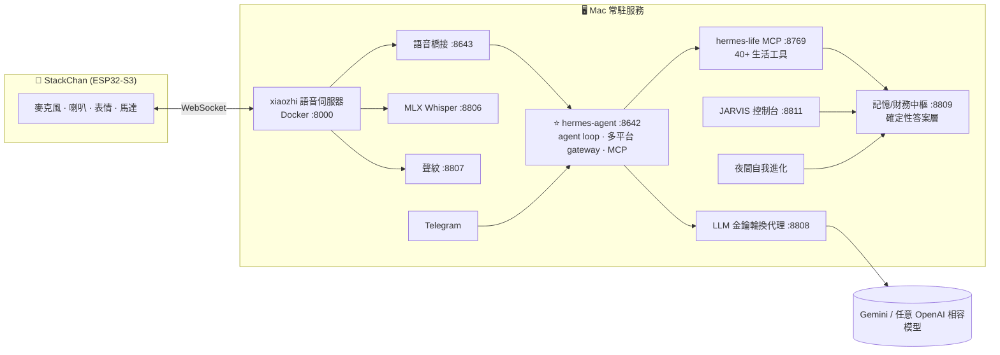

<div align="center">

# 🤖 J.A.R.V.I.S

### 打造獨一無二的 AI 個人超級助手 — 有實體、隨時在、會自我進化。

**一顆大腦、三個分身:** 桌上機器人(語音)× Telegram × 鋼鐵人風格控制核心 — 共用同一份記憶、同一個人格、同一套工具。


[English](README.md) · [部署指南](docs/DEPLOY.md) · [擴充教學](docs/EXTENDING.md)

*(所有畫面皆為示範資料)*

</div>

---

## 為什麼做這個

市售助理是做給所有人的——也就等於不屬於任何人。Jarvis 完全相反:**一個圍繞著「一個人」打造的超級助手。** 它知道你的財務到個位數、你的習慣、你的目標、你喜歡被怎麼對待——而且每天晚上自己變得更好。

三個工程原則支撐這件事:

1. **數字用算的,不用生成的。** 所有財務答案來自確定性計算層,LLM 只負責照唸。
2. **到處都是同一顆大腦。** 語音、Telegram、控制台打同一個 agent、同一套工具、同一份記憶——講過一次,處處記得,即時同步。
3. **不用盯著也會進化。** 夜間排程回顧整天對話,精煉人格、盤點能力缺口、自己把缺的功能建出來。

## Jarvis 的一天

- **07:30** — Telegram 晨間簡報:天氣、行程、你持股的美股夜盤戰績
- **整天** — 對桌上的機器人開口:記帳、查任何財務切面、設提醒、管待辦、擬 email(你確認才寄)、叫它研究任何主題、甚至叫它**幫自己長出新功能**
- **盤中** — 盯著你的投資組合,大幅波動主動開口;台股/美股每日收盤自動推送完整損益戰報
- **隨時隨地** — 出門用 Telegram,是同一顆大腦;在家用 JARVIS 控制核心看全局
- **03:00** — 它讀完今天所有對話,萃取「怎麼把你服務得更好」寫進自己的人格,再盤點能力缺口、自主建置最有價值的一個——全程有備份、冒煙測試、自動還原護航
- **隔天 07:30** — 一個更好一點的 Jarvis 跟你一起醒來

## 功能

| 領域 | 能力 |
|---|---|
| 💰 **個人財務** | 收支/預算全紀錄 · 台股美股即時投資組合(報酬、當日損益、逐檔明細)· 淨資產走勢(日/週/月)· 目標缺口與複利試算 · 分類消費分析 · 語音記帳+確定性補記網 |
| 🗣️ **語音夥伴** | 喚醒詞、持續對話、插話 · Apple Metal 本機 Whisper 辨識(~1秒、繁體中文)· 聲紋認主人 · 情緒同步的表情與頭部動作 |
| 🧠 **記憶** | 向量+關鍵字混合檢索 · 對話事實確定性抽取 · 個人檔案每輪注入 · 控制台直接編輯即時生效 |
| 📱 **Telegram** | 全能力對話(與語音同一顆大腦)· 晨間簡報 · 台美股收盤損益戰報 · 持股盤中警報 · 預算節奏與發薪日推播 · 股票/幣價/地震/颱風/航班哨兵 · 遠端派工與建置核准 |
| 📬 **Email** | 擬稿+聯絡人搜尋 · 專業語氣模板 · 人工確認才寄送 · 控制台寄件匣直接編輯 |
| 🛠️ **自我擴充** | 一句話 → 全棧功能(後端 API+語音工具+控制台面板)自動上線,安全閘護航 · 夜間能力提案 |
| 🖥️ **控制核心** | 鋼鐵人 HUD · 財務投資視覺化(多層同心圓餅、互動走勢)· 記憶/對話/進化/寄件控制台 · 服務健康與模型切換 |
| 🔒 **隱私** | 聲紋身份閘 · 訪客自動財務遮罩 · 全部跑在自己的機器上 |

## 系統架構



### ⭐ 大腦:hermes-agent

整套系統的心臟是 **hermes-agent**——自架的 agent runtime,擔任所有管道的**唯一大腦**:

- **多平台 gateway**:一個行程同時服務 Telegram、語音橋接、OpenAI 相容 API——每個管道是「同一個 agent 本人」,不是同步出來的副本
- **伺服器端 agent loop**:多步推理、平行工具執行、迭代預算控管
- **MCP 原生工具**:能力以 MCP 工具註冊一次(hermes-life 管生活/財務、stackchan 管機器人身體),所有管道同時獲得
- **即時上下文注入**:個人事實、自我學到的相處守則(SOUL)、即時自我狀態,每一輪都是新鮮的
- **技能與自我認知**:可擴充的 skill hub + 每輪生成的 self-state,agent 永遠知道自己此刻能做什麼

### 🤖 身體:StackChan 串接

實體是跑在 M5Stack CoreS3(ESP32-S3)上的 [StackChan](https://github.com/meganetaaan/stack-chan) 機器人,端到端整合:

- **裝置端喚醒詞**(「Jarvis」),喚醒瞬間抬頭回應
- **WebSocket 音訊串流**到 xiaozhi 語音伺服器(Opus 16kHz),重連時音訊自動重新同步
- **持續對話**:回完繼續聽、不用重新喚醒,講到一半可以插話
- **ASR 層聲紋識別**:機器人知道「是誰在講話」,訪客自動觸發隱私遮罩
- **具身情緒**:LLM 每輪自選情緒,表情與頭部動作同步呈現
- **主動開口**:提醒與警報透過伺服器端語音佇列,讓機器人自己開口說話

### 📱 口袋分身:Telegram 串接

出門在外,Jarvis 不會把你交給一個比較笨的替身——**Telegram 由完全同一個 agent 行程服務**,帶著完整工具與完整記憶。它就是「不在家時的身體」:

- **用聊的做所有事** — 查財務、記帳、提醒、待辦、記憶、擬 email、網路研究、精算分析:能力與語音完全一致,因為**就是同一顆大腦**
- **主動情報,推到口袋** — 07:30 晨間簡報 · 台股/美股每日收盤完整損益戰報 · 持股大幅波動盤中即時警報 · 超支前的預算節奏預警 · 發薪日投資提醒
- **訂閱哨兵** — 股票、加密貨幣、地震、颱風、航班、深夜未歸關懷;有事發生的那一刻,Jarvis 主動傳訊給你
- **行動指揮中心** — 派發長時間研究任務、完成自動回報 · 收到「新功能已建置上線」的戰報 · 用一則回覆核准夜間能力提案
- **完美接續** — 中午在 Telegram 提過的事,晚上回家桌上的機器人已經知道

## 控制核心

互動式投資分析——可切換粒度的淨資產走勢與目標進度、可複選的多層資產配置同心環(市場/槓桿/個股)、每個切片都有懸浮明細:


| 首頁 HUD | 記帳 |
|---|---|
|  |  |

## 🧬 自我迭代 — 你睡覺時,它在變強

Jarvis 每晚對整天的對話紀錄執行**雙軌進化管線**:

**軌道一・人格(`self_reflect`,03:00)**
讀完當天每一段對話,萃取精煉的**相處守則**——你喜歡答案怎麼給、什麼會惹惱你、你在意什麼。守則去重、設上限、寫進 agent 的 SOUL,**隔天起每一輪對話都帶著**。它是真的「一覺醒來更懂你」。

**軌道二・能力(`self_review`,03:15)**
稽核同一份紀錄找能力缺口——答不出的問題、做不到的任務、你被迫重講的時刻。每個缺口轉成工程提案,**當晚自主建置價值最高的那一個**,其餘推到你的 Telegram 一鍵核准。

**讓自主變得可信的安全架構:**
1. 任何自我修改前,先對所有關鍵檔案做快照備份
2. 由內嵌的 coding agent 做全棧建置(後端+語音工具+控制台面板)
3. 對動到的一切做冒煙測試(Python AST・YAML・HTML 完整性)
4. 失敗自動還原——並有**自我修正迴圈**:把確切錯誤餵回去再試
5. 成功自動重啟上線:你醒來之前,新能力已經在線上

雙軌都採游標式增量處理——語音與 Telegram 的每段對話,恰好被回顧一次。

## 🧠 記憶系統 — 像人一樣記得,像資料庫一樣取用

記憶是分層工程,「認識你」永遠不靠模型「記得要去記」:

- **單一事實庫** — 所有長期事實存在同一個帶向量的儲存,是全管道共用的唯一真相
- **每輪必帶的個人檔案** — 關於你的核心事實隨**每一輪**上下文出發,你是誰從不交給檢索運氣
- **混合檢索** — 中文優化的關鍵字滑窗比對 + 本機語意向量,涵蓋核心之外的一切
- **確定性書記官** — 獨立監看器每幾分鐘掃描對話紀錄,以「寧可少記、絕不亂記」原則抽取長期事實——記憶捕捉不依賴模型呼叫工具
- **自我學習的 SOUL** — 人格+夜間反省學到的相處守則,可版本化、可編輯
- **雙向檔案同步** — agent 自己的使用者檔案與事實庫雙向對帳:快照式刪除保護(刪掉的記憶絕不復活)+ 語意相似閘(擋掉換句話說的重複)
- **有時效的記憶** — 事件型事實帶到期日,過期自動清除
- **一人一檔** — 機器人靠聲紋為認識的每個人建立獨立檔案,不是你的人自動觸發隱私遮罩
- **即時編輯** — 每筆記憶都能在控制台查看與編輯,下一輪對話立即生效
- **100% 本機** — 向量在本機計算,你的記憶永遠不離開你的機器

## 正確性工程

- **確定性答案層** — 高頻財務問題由 Python 直接算出完整句子,模型逐字照唸
- **語意正規化** — 任何講法先被輕量 LLM 改寫成標準問法(保留實體、中文數字轉換)再進確定性層——怎麼問都落在算出來的答案上
- **確定性補記網** — 記帳與記憶抽取是獨立的對話監看器,不依賴模型記得呼叫工具
- **安全閘自我修改** — 每次自主改碼前先備份、改完冒煙測試(AST/YAML/HTML 完整性)、失敗自動還原,並有自我修正迴圈

## 快速開始

```bash
git clone https://github.com/owen4sure/jarvis && cd jarvis
python3 -m venv .venv && .venv/bin/pip install -r brain/requirements-embodied.txt
cp .env.example .env                                              # 你的 LLM 金鑰
cp brain/config/finance.example.json brain/config/finance.json    # 你的數字
cp brain/config/telegram.example.json brain/config/telegram.json
cp brain/launchd/*.plist ~/Library/LaunchAgents/ && launchctl load ~/Library/LaunchAgents/com.hermes.*.plist
open http://localhost:8811
```

完整指南(9 個服務、機器人、大腦):**[docs/DEPLOY.md](docs/DEPLOY.md)**

## 擴充 Jarvis

三種方式,從零程式碼到完全掌控——包括直接**用講的叫 Jarvis 自己建**:
**[docs/EXTENDING.md](docs/EXTENDING.md)**

## License

MIT — 打造你自己的 Jarvis。
